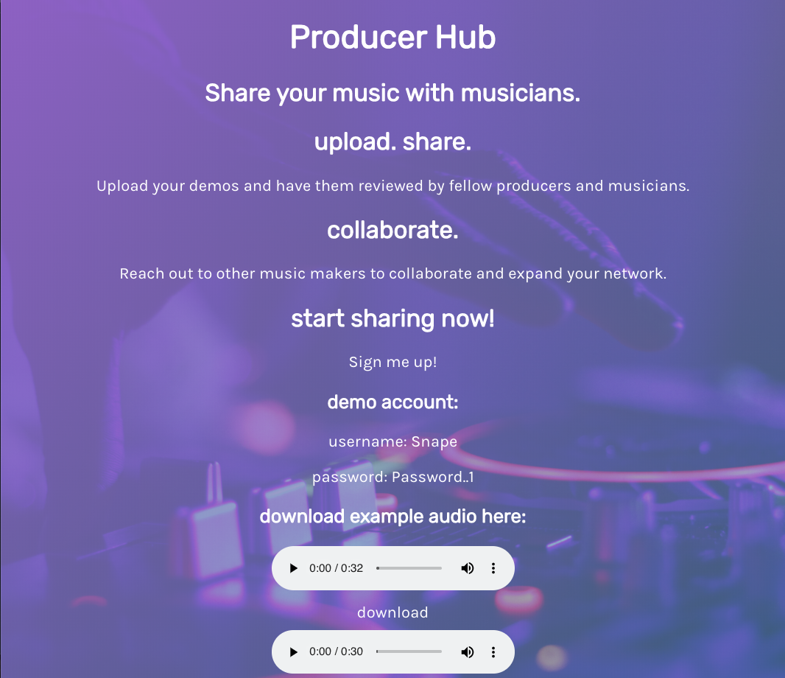
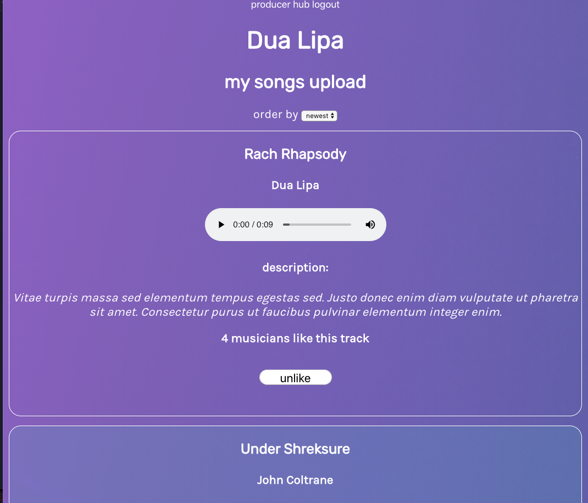
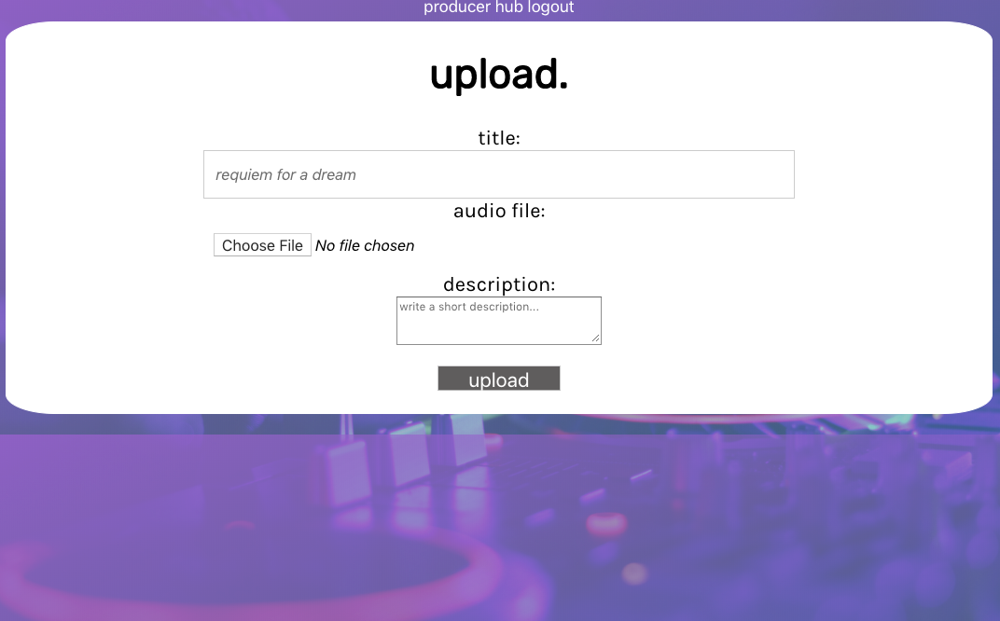
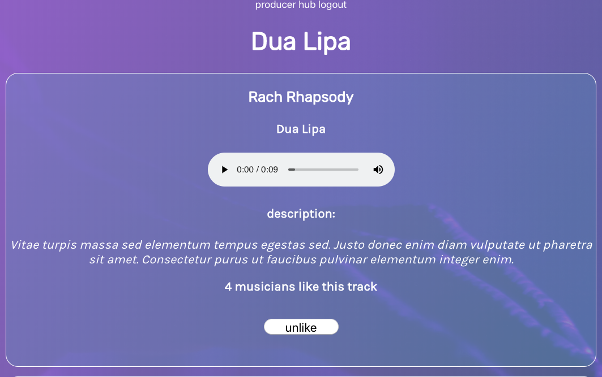

# Producer Hub
https://producerhub-client.now.sh/

A platform that allows users to share their own music demos and have them reviewed by peers.

## Landing Page

## Home Page

User can see a feed of songs and sort by newest/oldest. User can also like/unlike songs in their feed. 

## Upload

User can upload an audio file to an Amazon S3 bucket. User is then redirected to a success screen if the upload is complete.

## Songs By User

User can see songs by self or other users. 

## Technologies Used
React.js
Node.js
Postgresql
Amazon S3